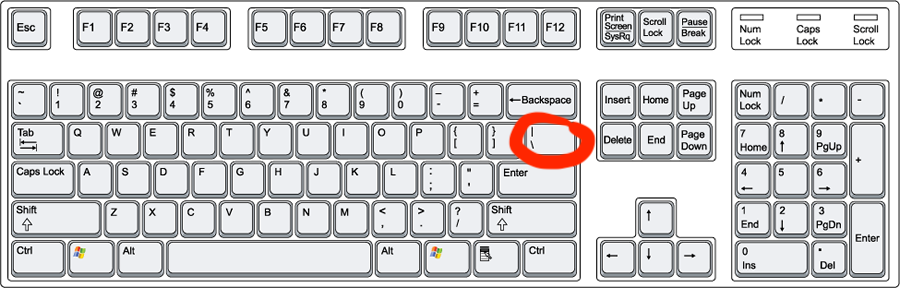

<!-- Function for hiding code!  -->

<!-- End of scripting functions! -->

# OR Operator

Just like our AND and NOT operators, the OR operator behaves just like the OR game from our logic gate lesson. The OR operator takes in two boolean values and spits out <code> true</code> if either of its inputs is true, otherwise it spits out <code> false</code>. The OR operator in p5js is two bars <code> || </code>.  The bar key on your keyboard is the right side of your main keyboard, between your delete/backspace and return/enter keys. See image below for help finding the bar key. You need to press SHIFT to get the bar character.    

## Exercise
Imagine you are somewhat a somewhat forgetful person. You are frequently forgetting your wallet and keys when you leave the house. You decide to make yourself a "safe to leave the house detector". You put an RFID emmiter on your keys and in your wallet and install a small microprocessor at your door that checks, everytime the door is opened, whether or not your keys & wallet are going through the door.  Assume you have boolean variables <code>haveKeys </code> and  <code>haveWallet</code>. Write code that will appropriate call a  <code>soundAlarm()</code> function if you're trying to leave the house unprepared!

<button onClick="myFunction('exKeys')"> Show Solution </button>

<pre><code>
if(!haveKeys || !haveWallet){
    soundAlarm()
}
</code></pre>

[Previous](./AND.html)
<!-- [Next](./elseif.html) -->
